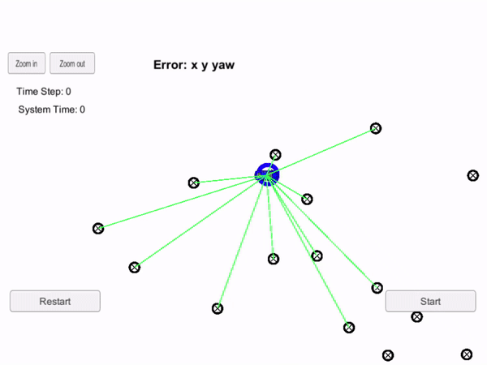

# CarND-Term2-P3-Kidnapped-Vehicle  
## Overview  
Your robot has been kidnapped and transported to a new location! Luckily it has a map of this location, a (noisy) GPS estimate of its initial location, and lots of (noisy) sensor and control data.  
In this project you will implement a 2 dimensional particle filter in C++. Your particle filter will be given a map and some initial localization information (analogous to what a GPS would provide). At each time step your filter will also get observation and control data.  
There is a simulator provided by Udacity ([Term 2 Simulator Release](https://github.com/udacity/self-driving-car-sim/releases/)) which can generate noisy landmark measurements. And you will be using those measurements to predict and match them to the given landmark location. In that way, you can tell where is your car and where it is heading to. This implementation is known as localization.  
Here is the link to the [orginal repository](https://github.com/udacity/CarND-Kidnapped-Vehicle-Project) provided by Udaciy. This repository contains all the code needed to complete the final project for the Localization course in Udacity's Self-Driving Car Nanodegree.

## Prerequisites/Dependencies  
* cmake: 3.5  
  * All OSes: [click here for installation instructions](https://cmake.org/install/)  
* make: 4.1 (Linux and Mac), 3.81 (Windows)  
  * Linux: make is installed by default on most Linux distros  
  * Mac: [install Xcode command line tools to get make](https://developer.apple.com/xcode/features/)  
  * Windows: [Click here for installation instructions](http://gnuwin32.sourceforge.net/packages/make.htm)  
* gcc/g++: 5.4  
  * Linux: gcc / g++ is installed by default on most Linux distros  
  * Mac: same deal as make - [install Xcode command line tools](https://developer.apple.com/xcode/features)  
  * Windows: recommend using [MinGW](http://www.mingw.org/)  
## Setup Instructions (abbreviated)  
1. Meet the `Prerequisites/Dependencies`  
2. Intall `uWebSocketIO ` on your system  
  2.1 Windows Installation  
  2.1.1 Use latest version of Ubuntu Bash 16.04 on Windows 10, here is the [step-by-step guide](https://www.howtogeek.com/249966/how-to-install-and-use-the-linux-bash-shell-on-windows-10/) for setting up the utility.  
  2.1.2 (Optional) Check your version of Ubuntu Bash [here](https://www.howtogeek.com/278152/how-to-update-the-windows-bash-shell/).  
3. Open Ubuntu Bash and clone the project repository  
4. On the command line execute `./install-ubuntu.sh`  
5. Build and run your code.  
## Project Description  
- [main.cpp](./src/main.cpp):Reads in data, calls a function to run the particle filter
- [particle_filter.cpp](./src/ukf.cpp): Initializes the particle filter, calls the predict, data association and resample functions, defines the predict, data prediction and resample functions
- [README.md](./README.md): Writeup for this project, including setup, running instructions and project rubric addressing.  
- [CMakeLists.txt](./CMakeLists.txt): `CMakeLists.txt` file that will be used when compiling your code (you do not need to change this file)
## Run the project  
* Clone this respository
* At the top level of the project repository, create a build directory: `mkdir build && cd build`
* In `/build` directory, compile yoru code with `cmake .. && make`
* Launch the simulator from Windows
* Execute the run command for the project `./particle_filter` (Make sure you also run the simulator on the Windows host machine) If you see * * this message, it is working `Listening to port 4567 Connected!!!`
## Success Criteria  
If your particle filter passes the current grading code in the simulator (you can make sure you have the current version at any time by doing a `git pull`), then you should pass!

The things the grading code is looking for are:

1. **Accuracy**: your particle filter should localize vehicle position and yaw to within the values specified in the parameters `max_translation_error` and `max_yaw_error` in `src/main.cpp`.

2. **Performance**: your particle filter should complete execution within the time of 100 seconds.

## Project Rubric  
### 1. Accuracy  
#### 1.1 Does your particle filter localize the vehicle to within the desired accuracy?  
Yes, it does.  
### 2. Performance  
#### 2.1 Does your particle run within the specified time of 100 seconds?  
Yes, it does.
### 3. General  
#### 3.1 Does your code use a particle filter to localize the robot?  
Yes, it does.  
## Code Style  
Please (do your best to) stick to [Google's C++ style guide](https://google.github.io/styleguide/cppguide.html).
## Videos
Video recordings for success cases.  
Success case for running my particle filter code.  
  

